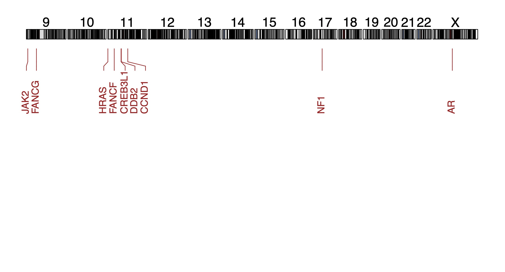

# Copy number analyses

```{r libraries and sources for cna analyses, echo = T, message=FALSE, warning=FALSE}
# Libraries and sources
library(tidyverse)
library(openxlsx)
library(GenomicRanges)
source('R/find_specific_cna_sc.R')
source('R/get_cytoband_coverage.R')
source('R/get_genes.R')
source('R/get_oncogenes.R')
source('R/plot_genes_karyotype.R')
```

## Colorectal cancer-specific arm-level copy number alterations per organoid

```{r Colorectal cancer-specific, echo = T, message=FALSE, warning=FALSE}
########
# Data #
########
load('../cna_analysis/rda/subclonal_dynamics/man_select_files_edivisive.rda')

# !!! GITHUB SPECIFIC CODE !!! #
# adding '../cna_analysis/' to each path within man_select_files_edivisive 
man_select_files_edivisive <- lapply(man_select_files_edivisive, function(x) paste0("../cna_analysis/", x))

###########
# Wrangle #
###########
# extract only prerad clines
# prerad clines
kra_list <-
  c("kra003",
    "kra005",
    "kra007",
    "kra009",
    "kra023",
    "kra025",
    "kra027")

#######
# Run #
#######

## finding common CNAs within each subclone for each organoids.
common_cnas <- find_specific_cna_sc(
  list_resistant = man_select_files_edivisive[kra_list],
  # make sure to input this as a list!
  list_sensitive = NULL,
  perc_cutoff_within_subclone_resistant = 0.8,
  # CNA needs to be in 80% of the cells or more
  perc_cutoff_within_subclone_sensitive = NULL,
  per_cutoff_across_subclone_resistant = NULL,
  per_cutoff_across_subclone_sensitive = NULL,
  return_cnas_per_subclone = T
)

## mapping CNA to cytoband location
# for amplifications
amplifications <-
  lapply(common_cnas$amplifications, get_cytoband_coverage)

# Extract frequency of arm level amplifications n indicates the how many
# organoids contain the CNA
arm_amp <- lapply(amplifications, function(x) {
  return(x[[2]])
}) %>%
  bind_rows(.id = "cline") %>%
  group_by(cline, chromosome, arm) %>%
  count(percentage_arm_affected > 0.8) %>%
  arrange(desc(n)) %>%
  ungroup(cline) %>%
  count(chromosome) %>%
  arrange(desc(n)) %>%
  mutate(freq = n / 7)

DT::datatable(arm_amp, caption = "Arm-level amplifications in organoids")

# for deletions
deletions <- lapply(common_cnas$deletions, get_cytoband_coverage)

# Extract frequency of arm level deletions. n indicates the how many
# organoids contain the CNA
arm_del <- lapply(deletions, function(x) {
  return(x[[2]])
}) %>%
  bind_rows(.id = "cline") %>%
  group_by(cline, chromosome, arm) %>%
  count(percentage_arm_affected > 0.8) %>%
  arrange(desc(n)) %>%
  ungroup(cline) %>%
  count(chromosome) %>%
  arrange(desc(n)) %>%
  mutate(freq = n / 7)

DT::datatable(arm_del, caption = "Arm-level deletions in organoids")

#######
# End #
#######


```

## Copy number alterations per subclone

### Copy number alterations specific to HUB062A

```{r hub062A CNAs, echo = T, message=FALSE, warning=FALSE}
########
# Data #
########
load('../cna_analysis/rda/subclonal_dynamics/subclone_list.rda')

# !!! GITHUB SPECIFIC CODE !!! #
# adding '../cna_analysis/' to each path within man_select_files_edivisive 
subclone_list <- lapply(subclone_list, function(x) paste0("../cna_analysis/", x))

###########
# Wrangle #
###########
# extracting resistant and sensitive subclones of hub062
hub062 <-
  names(subclone_list)[grepl('hub062', names(subclone_list))]
res <- hub062[grepl('hub062_postrad_a', hub062)]
sens <- hub062[grepl('hub062_postrad_b|hub062_postrad_c', hub062)]
# remove cycle 2
sens <- sens[!grepl('c2', sens)]

#######
# Run #
#######

## finding common CNAs within each subclone for each organoids.
hub062a_specific_cnas <- find_specific_cna_sc(
  list_resistant = subclone_list[res],
  list_sensitive = subclone_list[sens],
  perc_cutoff_within_subclone_resistant = 0.6,
  perc_cutoff_within_subclone_sensitive = 0.6,
  per_cutoff_across_subclone_resistant = 0.2,
  per_cutoff_across_subclone_sensitive = 0.2,
  return_cnas_per_subclone = F
)

## mapping CNA to cytoband location
# for amplifications
ampl_hub062a <-
  get_cytoband_coverage(hub062a_specific_cnas$unique_resistant_ampl)

DT::datatable(as.data.frame(ampl_hub062a[[1]]), caption = "HUB062A-specific amplifications (exact location)")

del_hub062a <-
  get_cytoband_coverage(hub062a_specific_cnas$unique_resistant_del)

# No HUB062A-specific deletions were found.
```

```{r gene_map, eval = F, echo = T, message=FALSE, warning=FALSE}
#######
# Run #
#######
# All genes #
#############
genes_ampl_hub062a <- get_genes(ampl_hub062a[[1]])

DT::datatable(as.data.frame(genes_ampl_hub062a), caption = "Genes on HUB062A-specific amplifications")

# Oncogenes #
#############
oncogenes_ampl_hub062a <- get_oncogenes(ampl_hub062a[[1]])

DT::datatable(as.data.frame(oncogenes_ampl_hub062a), caption = "Oncogenes on HUB062A-specific amplifications")
```

```{r karyotypeplot of HUB062A code, eval = F, echo = T, message=FALSE, warning=FALSE}
########
# Data #
########
load('../cna_analysis/rda/cna_analysis/hub062a_specific_cnas_genes.rda')

###########
# Wrangle #
###########
# plot_genes_karyotype needs a GRange with seqnames, ranges, strand and hgnc_symbol

# add ampl/del column
oncogenes_ampl_hub062a$cn <- 'amplified'


# bind dataframes
oncogenes <- oncogenes_ampl_hub062a

# extract needed columns
keep <-
  c('Gene Symbol',
    'chromosome_name',
    'start_position',
    'end_position',
    'cn')
oncogenes <- oncogenes[, keep]
# rename
colnames(oncogenes) <-
  c('hgnc_symbol', 'seqnames', 'start', 'end', 'cn')

# convert to dataframe
onco_grange <- makeGRangesFromDataFrame(oncogenes)

# metadata is deleted
onco_grange$hgnc_symbol <- oncogenes$hgnc_symbol
onco_grange$cn <- oncogenes$cn

##########################
# Choose genes to depict #
##########################
oncogenes_ampl_hub062a <-
  oncogenes_ampl_hub062a[order(oncogenes_ampl_hub062a$`Genome Location`),]

show_oncogenes_ampl <-
  c('FANCF',
    'CREB3L1',
    'DDB2',
    'HRAS',
    'CCND1',
    'NF1',
    'FANCG',
    'JAK2',
    'AR')

show_oncogenes <- c(show_oncogenes_ampl)

########
# PLOT #
########
plot_genes_karyotype(
  onco_grange,
  show_genes = show_oncogenes,
  dist = -45,
  show_chromosomes = c(
    "chr9",
    "chr10",
    "chr11",
    "chr12",
    "chr13",
    "chr14",
    "chr15",
    "chr16",
    "chr17",
    "chr18",
    "chr19",
    "chr20",
    "chr21",
    "chr22",
    "chrX"
  )
)

```

```{r karyotypeplot of HUB062A,  eval = T, echo = F, message=FALSE, warning=FALSE}


```

### Copy number alterations specific to resistant subclones
```{r resistance-specific copy number alterations,  echo = T, message=FALSE, warning=FALSE}
########
# Data #
########
load('../cna_analysis/rda/cna_analysis/hub062a_specific_cnas.rda')

###########
# Wrangle #
###########
# extracting resistant and sensitive subclones of hub062
# excluding HUB197, as here subclones were probably not selected on the basis of CNAs
# but on the basis of the presence of WGD!

resistant <- names(subclone_list)[c(grep('hub005_prerad_b', names(subclone_list)),
                                    grep('hub183_prerad', names(subclone_list)), 
                                    grep('hub062_postrad_a', names(subclone_list))
                                    )]


# in resistant, 
# in resistant, hub005 a.a and a.b need to be joined together, as they are no subclones
hub005_prerad_a.a_a.b <- c(subclone_list$hub005_prerad_a.a, subclone_list$hub005_prerad_a.b)

# joining the combined clones to resistant
res_list <- subclone_list[resistant]

res_list[['hub005_prerad_a.a_a.b']] <- hub005_prerad_a.a_a.b 

# comparing resistant to sensitive lines yields to many results.   
rest <- names(subclone_list)[c(grep('hub106_prerad', names(subclone_list)),
                                    grep('hub062_prerad_b', names(subclone_list)),
                                    grep('hub062_prerad_c', names(subclone_list)),
                                    grep('hub197_prerad_b', names(subclone_list))
                               
                               )]


rest_list <- subclone_list[rest]

#######
# Run #
#######
## finding common CNAs within each subclone for each organoid.
resistant_specific_cnas <- find_specific_cna_sc(
  list_resistant = res_list,
  list_sensitive = rest_list,
  perc_cutoff_within_subclone_resistant = 0.6, # needs to be present in 60% or more cells per subclone
  perc_cutoff_within_subclone_sensitive = 0.6,
  per_cutoff_across_subclone_resistant = 0.8, # if present in 80% of the subclones, it will be called a CNA and might thus be resistant-specific (depending on if it is also found in sensitive subclones)
  per_cutoff_across_subclone_sensitive = 0.1, # if present in 20%, it is already called a CNA in sensitive subclones and thus wont be detected as a resistant specific CNA
  return_cnas_per_subclone = F
)

## mapping CNA to cytoband location
# for amplifications
ampl_resistant <-
  get_cytoband_coverage(resistant_specific_cnas$unique_resistant_ampl)

del_resistant <-
  get_cytoband_coverage(resistant_specific_cnas$unique_resistant_del)

# Both ampl_resistant and del_resistant are empty, no resistance specific cnas
# shared by subclones was found

```

### Newly acquired copy number alterations
```{r new_cnas, echo = T, message=FALSE, warning=FALSE}
###############
# Description #
###############
# We are going to define the presence of 'new' CNAs after radiation therapy. 
# I define the following rules: 
# (i) Analysis will be done within subclone
# (ii) A 'new' CNA will be called new only if it was not found before radiation
# (iii) I exclude all subclones where the numbers of cells within a subclone is lower than 5. 
# (iv) Because in essence, all cells are related to each other (even those in distinct) 
# subclones, I am going to compare each post-rad subclone to all pooled subclones before
# radiation. 
# (v) We are looking for acquired CNAs; CNAs that could explain why cells with that 
# CNA propagated. Therefore, the CNA has to be present in at least 50% of the cells. 

###########
# Wrangle #
###########

# remove subclones with fewer than 5 cells pre-or post rad. 
lapply(subclone_list, length)

remove_me <- c('hub005_prerad_a.b', 'hub005_postrad_a.b', # because only 2 cells in hub005_postrad_a.b
               'hub062_prerad_a', # only 2 cells, here I am going to compare C1 vs C2, so 
               # I don't remove hub062_postrad_a
               'hub015_prerad_b', 'hub015_postrad_b', # only 1 cell in prerad
               'hub197_prerad_b','hub197_prerad_b', # extinction
               'hub197_prerad_c','hub197_postrad_c' # extinction
               )

subclone_list <- subclone_list[!(names(subclone_list) %in% remove_me)]

#############
# Variables #
#############
# Percentage of cells cut-off 
pcc <- 0.5

########
# RUNS #
########

# HUB183 #
######################################################################
# Extract HUB183
hub183 <- names(subclone_list)[grepl('hub183', names(subclone_list))]

# combine prerad subclones and a.b
hub183_prerad_subclones <- hub183[grepl('prerad', hub183)]

# get each postrad subclone individually
hub183_postrad_a <- hub183[grepl('hub183_postrad_a', hub183)]

# no new genomic aberrations
hub183_postrad_a <- find_specific_cna_sc(
  list_resistant = subclone_list[hub183_postrad_a],
  list_sensitive = subclone_list[hub183_prerad_subclones],
  perc_cutoff_within_subclone_resistant = pcc,
  perc_cutoff_within_subclone_sensitive = 0.001,
  per_cutoff_across_subclone_resistant = 0.001,
  per_cutoff_across_subclone_sensitive = 0.001,
  return_cnas_per_subclone = F
)

# HUB005 #
######################################################################

# Extract HUB005
hub005 <- names(subclone_list)[grepl('hub005', names(subclone_list))]

# combine prerad subclones and a.b
hub005_prerad_subclones <- hub005[grepl('prerad', hub005)]

# get each postrad subclone individually
hub005_postrad_a.a <- hub005[grepl('hub005_postrad_a.a', hub005)]
hub005_postrad_b <- hub005[grepl('hub005_postrad_b', hub005)]

# no new CNAs
hub005_postrad_a.a <- find_specific_cna_sc(
  list_resistant = subclone_list[hub005_postrad_a.a],
  list_sensitive = subclone_list[hub005_prerad_subclones],
  perc_cutoff_within_subclone_resistant = pcc,
  perc_cutoff_within_subclone_sensitive = 0.001,
  per_cutoff_across_subclone_resistant = 0.001,
  per_cutoff_across_subclone_sensitive = 0.001,
  return_cnas_per_subclone = F
)

# no new CNAs
hub005_postrad_b <- find_specific_cna_sc(
  list_resistant = subclone_list[hub005_postrad_b],
  list_sensitive = subclone_list[hub005_prerad_subclones],
  perc_cutoff_within_subclone_resistant = pcc,
  perc_cutoff_within_subclone_sensitive = 0.001,
  per_cutoff_across_subclone_resistant = 0.001,
  per_cutoff_across_subclone_sensitive = 0.001,
  return_cnas_per_subclone = F
)


# HUB015 #
######################################################################

# Extract HUB015
hub015 <- names(subclone_list)[grepl('hub015', names(subclone_list))]

# combine prerad subclones and a.b
hub015_prerad_subclones <- hub015[grepl('prerad', hub015)]

# get each postrad subclone individually
hub015_postrad_a.a <- hub015[grepl('hub015_postrad_a.a', hub015)]
hub015_postrad_a.b <- hub015[grepl('hub015_postrad_a.b', hub015)]
hub015_postrad_b <- hub015[grepl('hub015_postrad_b', hub015)]

# hub015_postrad_a.a: new deletion on 4q
hub015_postrad_a.a <- find_specific_cna_sc(
  list_resistant = subclone_list[hub015_postrad_a.a],
  list_sensitive = subclone_list[hub015_prerad_subclones],
  perc_cutoff_within_subclone_resistant = pcc,
  perc_cutoff_within_subclone_sensitive = 0.001,
  per_cutoff_across_subclone_resistant = 0.001,
  per_cutoff_across_subclone_sensitive = 0.001,
  return_cnas_per_subclone = F
)

# HUB015 has a new deletion following radiation in 4q
DT::datatable(as.data.frame(get_cytoband_coverage(hub015_postrad_a.a$unique_resistant_del)[[1]]))

# This deletion contains the following oncogenes
DT::datatable(get_oncogenes(get_cytoband_coverage(hub015_postrad_a.a$unique_resistant_del)[[1]]))

# hub015_postrad_a.a: no new amplificatoins no new deletions
hub015_postrad_a.b <- find_specific_cna_sc(
  list_resistant = subclone_list[hub015_postrad_a.b],
  list_sensitive = subclone_list[hub015_prerad_subclones],
  perc_cutoff_within_subclone_resistant = pcc,
  perc_cutoff_within_subclone_sensitive = 0.001,
  per_cutoff_across_subclone_resistant = 0.001,
  per_cutoff_across_subclone_sensitive = 0.001,
  return_cnas_per_subclone = F
)

# 

# HUB106 #
######################################################################

# Extract HUB106
hub106 <- names(subclone_list)[grepl('hub106', names(subclone_list))]

# combine prerad subclones and a.b
hub106_prerad_subclones <- hub106[grepl('prerad', hub106)]

# get each postrad subclone individually
hub106_postrad_a <- hub106[grepl('hub106_postrad_a', hub106)]
hub106_postrad_b <- hub106[grepl('hub106_postrad_b', hub106)]
hub106_postrad_c <- hub106[grepl('hub106_postrad_c', hub106)]


# no new CNAs
hub106_postrad_a <- find_specific_cna_sc(
  list_resistant = subclone_list[hub106_postrad_a],
  list_sensitive = subclone_list[hub106_prerad_subclones],
  perc_cutoff_within_subclone_resistant = pcc,
  perc_cutoff_within_subclone_sensitive = 0.001,
  per_cutoff_across_subclone_resistant = 0.001,
  per_cutoff_across_subclone_sensitive = 0.001,
  return_cnas_per_subclone = F
)

# no new CNAs
hub106_postrad_b <- find_specific_cna_sc(
  list_resistant = subclone_list[hub106_postrad_b],
  list_sensitive = subclone_list[hub106_prerad_subclones],
  perc_cutoff_within_subclone_resistant = pcc,
  perc_cutoff_within_subclone_sensitive = 0.001,
  per_cutoff_across_subclone_resistant = 0.001,
  per_cutoff_across_subclone_sensitive = 0.001,
  return_cnas_per_subclone = F
)

# no new CNAs
hub106_postrad_c <- find_specific_cna_sc(
  list_resistant = subclone_list[hub106_postrad_c],
  list_sensitive = subclone_list[hub106_prerad_subclones],
  perc_cutoff_within_subclone_resistant = pcc,
  perc_cutoff_within_subclone_sensitive = 0.001,
  per_cutoff_across_subclone_resistant = 0.001,
  per_cutoff_across_subclone_sensitive = 0.001,
  return_cnas_per_subclone = F
)


# HUB062 #
######################################################################
hub062 <- names(subclone_list)[grepl('hub062', names(subclone_list))]

# combine prerad subclones and a.b
hub062_prerad_subclones <- hub062[grepl('prerad', hub062)]

# get each postrad subclone individually
hub062_postrad_a <- hub062[grepl('hub062_postrad_a', hub062)]
hub062_postrad_b <- hub062[grepl('hub062_postrad_b', hub062)]
hub062_postrad_c <- hub062[grepl('hub062_postrad_c', hub062)]
hub062biological_postrad_a <- hub062[grepl('hub062biological_postrad_a', hub062)]
hub062_postrad_c2_a <- hub062[grepl('hub062_postrad_c2_a', hub062)]
hub062_postrad_c2_c <- hub062[grepl('hub062_postrad_c2_c', hub062)]

# No new CNAs
hub062_postrad_a <- find_specific_cna_sc(
  list_resistant = subclone_list[hub062_postrad_a],
  list_sensitive = subclone_list[hub062_prerad_subclones],
  perc_cutoff_within_subclone_resistant = pcc,
  perc_cutoff_within_subclone_sensitive = 0.001,
  per_cutoff_across_subclone_resistant = 0.001,
  per_cutoff_across_subclone_sensitive = 0.001,
  return_cnas_per_subclone = F
)

# No new CNAs
hub062_postrad_b <- find_specific_cna_sc(
  list_resistant = subclone_list[hub062_postrad_b],
  list_sensitive = subclone_list[hub062_prerad_subclones],
  perc_cutoff_within_subclone_resistant = pcc,
  perc_cutoff_within_subclone_sensitive = 0.001,
  per_cutoff_across_subclone_resistant = 0.001,
  per_cutoff_across_subclone_sensitive = 0.001,
  return_cnas_per_subclone = F
)

# No new CNAs
hub062_postrad_c <- find_specific_cna_sc(
  list_resistant = subclone_list[hub062_postrad_c],
  list_sensitive = subclone_list[hub062_prerad_subclones],
  perc_cutoff_within_subclone_resistant = pcc,
  perc_cutoff_within_subclone_sensitive = 0.001,
  per_cutoff_across_subclone_resistant = 0.001,
  per_cutoff_across_subclone_sensitive = 0.001,
  return_cnas_per_subclone = F
)

# No new CNAs
hub062biological_postrad_a <- find_specific_cna_sc(
  list_resistant = subclone_list[hub062biological_postrad_a],
  list_sensitive = subclone_list[hub062_prerad_subclones],
  perc_cutoff_within_subclone_resistant = pcc,
  perc_cutoff_within_subclone_sensitive = 0.001,
  per_cutoff_across_subclone_resistant = 0.001,
  per_cutoff_across_subclone_sensitive = 0.001,
  return_cnas_per_subclone = F
)

# No new CNAs
hub062_postrad_c2_a <- find_specific_cna_sc(
  list_resistant = subclone_list[hub062_postrad_c2_a],
  list_sensitive = subclone_list[hub062_prerad_subclones],
  perc_cutoff_within_subclone_resistant = pcc,
  perc_cutoff_within_subclone_sensitive = 0.001,
  per_cutoff_across_subclone_resistant = 0.001,
  per_cutoff_across_subclone_sensitive = 0.001,
  return_cnas_per_subclone = F
)

# No new CNAs
hub062_postrad_c2_c <- find_specific_cna_sc(
  list_resistant = subclone_list[hub062_postrad_c2_c],
  list_sensitive = subclone_list[hub062_prerad_subclones],
  perc_cutoff_within_subclone_resistant = pcc,
  perc_cutoff_within_subclone_sensitive = 0.001,
  per_cutoff_across_subclone_resistant = 0.001,
  per_cutoff_across_subclone_sensitive = 0.001,
  return_cnas_per_subclone = F
)

```


